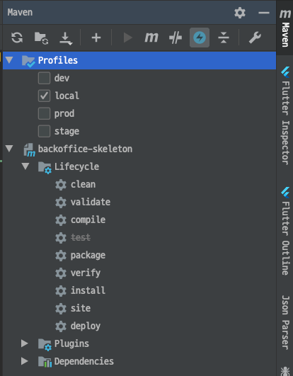
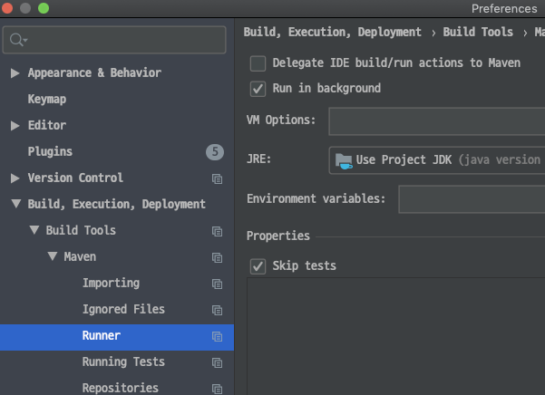

# SpringBoot Maven Skeleton 프로젝트
가장 기본적인 상태의 SpringBoot Maven Skeleton 프로젝트

## Spec
- **SpringBoot 2.5.7**
- **JAVA 11**
- **ORM Jooq 3.14.15**
- **Swagger 3.0.0**
- **Build: Maven**

## 기본 구성
- **Jooq Generator** 다중 스키마 설정
- **Jooq** 멀티**DB** 설정
- 공통 파일 다운로드/업로드 기능 (**AWS S3**)
- 공통 엑셀 다운로드 기능
- 공통 엑셀 업로드 기능
- **Exception Handler** 설정
- **ERROR** 메세지 **Dooray** 메신저로 전송 설정
- **Profile** 별 로그 설정
- **Profile** 별 **Yaml** 파일 설정
- **Base** 테스트 클래스
- **Sample API** 코드 및 테스트 코드
- **Sample** 엑셀 업로드/다운로드 **API** 코드 및 테스트 코드
- **Sample** 파일 업로드/다운로드 **API** 코드 및 테스트 코드
- 공통 메인 코드 **API** 코드 및 테스트코드
- 공통 상세 코드 **API** 코드 및 테스트코드

## Swagger UI
관련 정보 참조
- springfox: https://github.com/springfox/springfox
- springfox-demos: https://github.com/springfox/springfox-demos

- Swagger UI URL: `/swagger-ui/index.html`
    - ex) http://localhost:8080/swagger-ui/index.html

`/swagger-ui.html` 입력시 `/swagger-ui/index.html` 로 리다이렉트 됨

## active profile

**active profile**은 **h2 profile**로 설정되어있음
다른 **profile**을 **active profile**로 설정하고 싶으면
`activation` 부분을 잘라내서 원하는 **profile**에 설정하면 됨
 
```xml
<profiles>
    <profile>
        <id>h2</id>
        <properties> <!-- resource 필터 사용시 개발자 PC에 적용되는 필터 properties 의 폴더 위치 -->
            <!--                <deployTarget>local</deployTarget>-->
            <env>h2</env>
        </properties>
        <!-- DB를 붙여서 Application을 개발하기 시작하면 activation을 dev 로 이동 -->
        <activation>
            <!-- Jenkins Build 시 별도의 profile 값을 넘겨주지 않으면 기본값으로 설정됨-->
            <activeByDefault>true</activeByDefault>
        </activation>
    </profile>
    <profile>
        <id>local</id>
        <properties> <!-- resource 필터 사용시 개발서버에 적용되는 필터 properties 의 폴더 위치 -->
            <!--                <deployTarget></deployTarget>-->
            <env>local</env>
        </properties>
    </profile>
</profiles>
```
## h2 H2 DB 설정

**h2 profile**에 **H2 DB** 셋팅이 되어 있어 별도의 **DB** 셋팅 없이  
**h2 profile**로 **Application** 실행시 **H2 DB** 가 생성되어 실행됨  
**H2 DB** 셋팅을 사용하고 싶지 않으면 **active profile** 설정을 **h2**가 아닌 다른 **profile**로 변경하면 됨

### `application-h2.yml` 의 H2 DB 셋팅
```yaml
spring:
  datasource:
    platform: h2
    ## 공통 코드 테이블 생성
    schema: classpath:sql/common-h2.sql
    ## 공통 코드 테스트 데이터 INSERT
    data: classpath:sql/data-h2.sql
    ## 로컬에서 H2 DB에 초기 테이블을 만들어주는 설정 H2 DB를 사용하지 않으면 주석처리
    initialization-mode: always
    ## h2 DB 사용 설정
    url: jdbc:h2:~
    driver-class-name: org.h2.Driver
    username: sa
    password:
  h2:
    console:
      ## h2 console 사용
      enabled: true
      ## /h2 로 접속 지정하지 않으면 /h2-console 로 접속
      path: /h2
  jooq:
    sql-dialect: h2
```

### IntelliJ에서 다른 Profile로 Maven Build 하는 방법
**Profiles** 에서 원하는 **Profile** 을 체크 하고 **Lifecycle**의 **Compile**을 더블클릭하면

`pom.xml` 파일에 **profiles** 에서 해당되는 **Profile** 설정으로 **Maven Build** 를 수행한다 

현재 **Active Profile** 설정은 **dev** 로 되어있으므로 따로 설정하지 않으면 기본으로 **dev profile**이 적용된다



## IntelliJ IDEA 에서 Test Skip 하는 설정

`Build, Execution, Deployment - Build Tools - Maven - Runner` 에서 `Skip tests`

