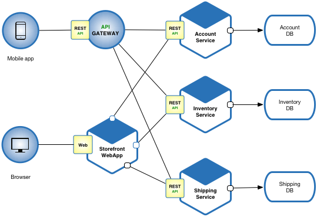

# CompletableFuture 의 실무
https://www.hungrydiver.co.kr/bbs/detail/develop?id=2&scroll=comment

## CompletableFuture 를 언제 쓸 수 있는가?
아래는 microservices.io 사이트에서 가져온 예제이다

- CompletableFuture 를 사용할 만한 부분은 API GATEWAY, Storefront WebApp 라고 할 수 있다
  이유는 Account, Inventory, Shipping Service 는 DATA BASE 와 연동하고 있기 때문이다
  java 환경에서 RDBMS 연동시에 아직 Async 한 인터페이스 방식을 제공하고 있지 않기 때문에 Async 개발을 해서 큰 효과를 얻기 부족하다

- 하지만 GATEWAY 등은 REST Service 와 연동하기 때문에 Async 를 통한 성능 효과를 볼 수 있다 (Blocking Thread 문제 해결 등)